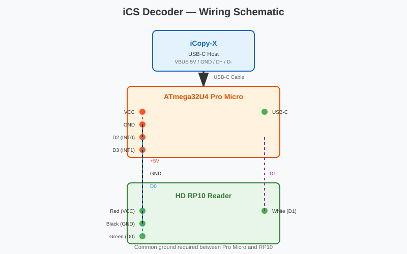
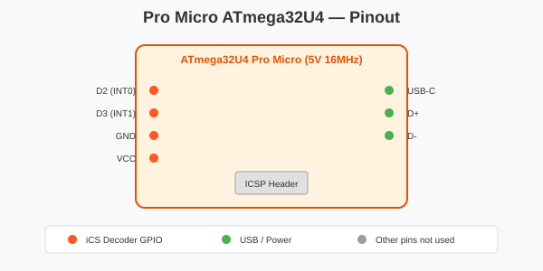

# iCopy-X iCS Decoder

Firmware to emulate the Lab401 iCS Decoder for the iCopy-X. Reads iCLASS SE / iCLASS SEOS cards via the HD RP10 reader and presents them to the iCopy-X as a USB CDC serial accessory.

## How It Works

1. RP10 reads iCLASS SE / iCLASS SEOS card via its 13.56 MHz interface
2. RP10 outputs card data in Wiegand format on D0/D1
3. ATmega32U4 captures Wiegand bits and extracts Facility Code / Card Number
4. ATmega32U4 formats the card payload and sends it to the iCopy-X over USB-C

## Hardware

| Component | Details |
|-----------|---------|
| MCU | SparkFun Pro Micro clone ATmega32U4 5V 16MHz (Amazon B0B6HYLC44) |
| RFID Reader | HID multiCLASS SE RP10 / RP40 |
| Connection | USB-C to iCopy-X |

> **Important:** These Pro Micro clones require a USB-C hardware modification (5.1kΩ resistors on CC1 and CC2) to power properly from the iCopy-X. See `docs/build-instructions.md` for details.

## Wiring



### Pro Micro Pinout



| Pro Micro Pin | RP10 Wire | Function |
|---------------|-----------|----------|
| VCC | Red | +5V power to reader |
| GND | Black | Common ground |
| Pin 2 (D0, INT0) | Green | Wiegand D0 |
| Pin 3 (D1, INT1) | White | Wiegand D1 |

> Keep D0/D1 leads short (<15 cm) to preserve Wiegand timing integrity. The RP10 draws ~75 mA standby, ~100 mA peak.

## Protocol

The device enumerates as a USB CDC serial port. The iCopy-X communicates with a simple text protocol:

| Direction | Data |
|-----------|------|
| iCopy-X → Device | `Who\r\n` |
| Device → iCopy-X | `ISE\r\n` |
| iCopy-X → Device | `RD\r\n` |
| Device → iCopy-X | `OK\r\n` + `$A_CARD_START$` block, or `??\r\n` |

### Card Payload Format

```
$A_CARD_START$
wiedata#:<binary bitstream>
Bit#:<bit count>
FC#:<facility code>
ID#:<card number>
Hex#:<hex value>
Blk7#:<64-bit hex>
Bits#:<48-bit padded binary>
$A_CARD_STOP$
```

### Example Output

```
$A_CARD_START$
wiedata#:11100101100110111001000001
Bit#:26
FC#:203
ID#:14112
Hex#:2007966e41
Blk7#:0000000007966e41
Bits#:00000010000000000111100101100110111001000001
$A_CARD_STOP$
```

## Build Instructions

### Prerequisites

- Windows 10/11, macOS, or Linux
- Arduino IDE 2.x or PlatformIO
- USB-C cable to connect Pro Micro to PC

### Arduino IDE

1. Install **Arduino AVR Boards** via Boards Manager
2. Select **Tools → Board → AVR Boards → Arduino Leonardo**
   *(The Pro Micro ATmega32U4 uses the same core as Leonardo.)*
3. Open `firmware/ics-decoder/ics-decoder.ino`
4. Select the correct COM port under **Tools → Port**
5. Click **Upload**

### PlatformIO

```bash
pio run -t upload
```

## Development

### Directory Structure

```
├── firmware/
│   ├── ics-decoder/       # Production iCS Decoder firmware
│   └── wiegand-sniffer/   # Debug tool for validating Wiegand capture
├── docs/
│   ├── build-instructions.md
│   └── wiring.md
├── memory-bank/            # Project research, decisions, progress
└── README.md
```

### Firmware Variants

- **`ics-decoder`** — Production firmware implementing the complete Who/ISE/RD protocol
- **`wiegand-sniffer`** — Debug tool that outputs raw Wiegand data to Serial Monitor for validation

## License

PolyForm Noncommercial License 1.0.0 — see [LICENSE](LICENSE).

## Disclaimer

This project is for pentesting and RFID research purposes only. The iCS Decoder protocol is proprietary and reverse-engineered. This software cannot be used in a commercial context.
